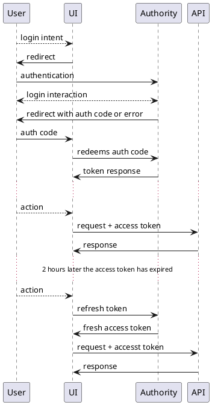

[[_TOC_]]

# At a glance

StudyBuilder implements the OAuth 2 protocol for authorization and the superimposed OpenID Connect protocol. 

- API mandates the clients to include a valid access-token in the header of HTTP request
- JWT tokens are used, which are cryptographically signed by the authority, and has a JSON payload (called claims) 
  about the user and granted permissions (roles) for the application.
- Access tokens are short living. The UI also obtains a refresh token, that lives longer,
  and used to request a fresh access token when needed.

Recommended reading:
- [Scenario description: Protected web API - verify users calling a web api](https://docs.microsoft.com/en-us/azure/active-directory/develop/scenario-protected-web-api-overview)
- [Microsoft Identity Platform access tokens](https://docs.microsoft.com/en-us/azure/active-directory/develop/access-tokens) 

# Authorization code flow

The client applications, like StudyBuilder UI has to initiate an
[OAuth 2.0 authorization code flow](https://docs.microsoft.com/en-us/azure/active-directory/develop/v2-oauth2-auth-code-flow)
(also called authorization code grant) with the identity provider.
StudyBuilder UI uses [oidc-client-ts](https://github.com/authts/oidc-client-ts) library, which supports the OAuth 2.0
and OpenID Connect protocols, and also reads the
[OpenID Connect Discovery](https://openid.net/specs/openid-connect-discovery-1_0.html)
metadata from the identity provider for obtaining its configuration.
During the authorization flow the client application has to specify to which service it wants to get an access 
token to, that is done in the _scopes_ parameter of the authorization request. 

The authorization flow starts by redirecting the user's browser to the identity provider's website, where the users can 
authenticate themselves. This redirect URL contains the important parameters
like the client application id, and one or more service scopes in the _scopes_ parameter. In case of 
*clinical-mdr-api* the scopes are prefixed with the application URI, which could be based on the URL of the 
application or an identifier made up from the application id like *api://48475-764352-74536* depending on what the 
identity provider prefers.

After authentication, the browser gets redirected back to the client application, with some payload in the URL.
The payload can be either an error message, or an authorization code response. The authorization code is a 
single-use token, which the client application can redeem to a set of tokens by querying the Identity Provider. 
Depending on whether the *openid* and *offline_access* scopes are requested (default config) the set of tokens 
would include an access token (always), an id token (not used; contains information about the authenticated user), 
and a refresh token (for obtaining a new access token when the previous one gets expired).

The access token is a cryptographically signed JWT token with a JSON payload called claims. Claims include service and  
time constrains about the token, information about the user and the client application, as well as the 
roles the caller has when interacting with the service.

Recommended reading:
- [Authorization request](https://www.oauth.com/oauth2-servers/authorization/the-authorization-request/)
- [Authorization code response](https://www.oauth.com/oauth2-servers/authorization/the-authorization-response/)
- [Authorization code flow for single-page apps](https://www.oauth.com/oauth2-servers/single-page-apps/)
- [Authorization code flow](https://docs.microsoft.com/en-us/azure/active-directory/develop/v2-oauth2-auth-code-flow) on Microsoft Identity Platform
- [OAuth 2.0 RFC6749](https://datatracker.ietf.org/doc/html/rfc6749)
  - [Authorization code flow](https://datatracker.ietf.org/doc/html/rfc6749#section-4.1)
  - [Refreshing an access token](https://datatracker.ietf.org/doc/html/rfc6749#section-6)
- [OpenID Connect Core 1.0](https://openid.net/specs/openid-connect-core-1_0.html)

## Flow Diagram

- **User**: the actor with their browser
- **UI**: StudyBuilder UI Single-Page-Application running in user's browser
- **Authority**: the OAuth Authority, aka. Identity Provider, in our case this is Azure Active Directory
- **API**: our Clinical-MDR API Python application

# Application registrations

The following is a guide for application registration in the Azure Active Directory as identity provider.
Theoretically StudyBuilder could be able to work with different OAuth-compatible identity providers as well, 
although it is not tested. With some OAuth experience, based on this guide, it should be possible to infer the setup 
with a different identity provider.

## clinical-mdr-api

- **Authentication** menu: leave defaults, no URLs added, *Allow public client flows* disabled (default)
- **Certificates and Secrets**: create the following *Client secrets* (take a note of the secrets, as they get shown 
  only once)
  - MS Graph API integration
  - Automated processes: Like system-tests, studybuilder-export, studybuilder-import.
- **Token configuration**: empty
- **API permissions**: Add these permissions for the application to allow it to communicate with other services,
  and *Grant admin consent* on all of them.
  *clinical-mdr-api* should refer back to this application itself, and those roles are required unless the various 
  automated processes (test, import, export) not moved to a different client application registration.
  *clinical-mdr-api* permissions can be added only after they have been created in the *App roles* section.

| API                 | Permission            | Type        | Admin consent required | Notes                           |
|---------------------|-----------------------|-------------|------------------------|---------------------------------|
| Microsoft Graph     | GroupMember.Read.All  | application | yes                    | For Ms Graph API integration    |
| Microsoft Graph     | User.Read.All         | application | yes                    | For Ms Graph API integration    |
| Microsoft Graph     | User.Read             | delegated   | no                     | granted by default, let's keep  |
| *clinical-mdr-api*  | Library.Read          | application | yes                    | For automated processes         |
| *clinical-mdr-api*  | Library.Write         | application | yes                    | For automated processes         |
| *clinical-mdr-api*  | Study.Read            | application | yes                    | For automated processes         |
| *clinical-mdr-api*  | Study.Write           | application | yes                    | For automated processes         |

- **Expose API**:
  - Create an *Application ID URI* we use *api://* prefix and the application id.
    This URI identifies the API, it is used the prefix for scopes in the OAuth authorization request.
    It's either *api://<application-id>*, or a more readable URI can be used also.
    This is used to prefix scopes when initiating an authorization request.
  - *Add a scope*: `API.Call`, *Admins and users* can both consent.
    This is a dummy scope, but we had to define at least one scope so the client applications can request it in the 
    authorization flow to indicate that they request access to this application. 
  - Later you will need to revisit this menu to add client applications one-by-one in *Authorized client 
    applications* section.
- **App roles**: All roles clinical-mdr-api uses shall be listed here, so later in *Enterprise applications* -> 
  *Users and groups* these roles can be assigned to different groups. (*Azure AD Free* subscription does not allow 
  granting roles to groups, so users can shall be granted each role one by one - as we do in our sandbox tenant.)
  Configuring app roles can be skipped if Role-based Access Control is not required, and should be disabled with the
  `OAUTH_RBAC_ENABLED=false` environment variable.

| Display name   | Description                                   | Allowed member types      | Value         |
|----------------|-----------------------------------------------|---------------------------|---------------|
| Library Writer | Create and Edit Library items.                | Users/Groups,Applications | Library.Write | 
| Library Reader | List and Read Library items.                  | Users/Groups,Applications | Library.Read  |
| Study Writer   | Create and Edit Studies and their properties. | Users/Groups,Applications | Study.Write   |
| Study Reader   | List and Read Studies and their properties.   | Users/Groups,Applications | Study.Read    |

- **Owners**: as required
- **Roles and administrators**: *Cloud application administrators* is there by default
- **Manifest**: Edit the manifest document, and change:
  `"accessTokenAcceptedVersion": 2,`

On the **Overview** page take a note of *Application ID* which is going to be the `OAUTH_API_APP_ID` setting,
and on the *App registrations* / *Endpoints* menu 
(top of the center content-area) the *OpenID Connect metadata document* which will go into `OAUTH_METADATA_URL` 
setting.

## Client application registration:

Ideally we would create a separate registration for each client application, but it is also possible to share the 
registration between StudyBuilder UI and Swagger UI, just add the URLs of both at the *Redirect URIs* below.  

- **Authentication**:
  - **Redirect URIs**:
    - For StudyBuilder UI, add a *Single-page application* with *Redirect URI* set to the OAuth callback URL of the 
      hosted UI application like `https://sb.example.com/oauth-callback` (use HTTPS except for localhost)
    - For Swagger UI, add a *Single-page application* with *Redirect URI* set to the OAuth callback URL of the hosted 
      clinical-mdr-api like `https://sb.example.com/api/docs/oauth2-redirect` (use HTTPS except for localhost)
    - For the StudyBuilder Word addon, add platform as *Mobile and desktop application* and enable all three pre-defined 
      redirect URLs for now (there's some uncertainty while it is under development)
- **Certificates and Secrets**: Single-page, mobile and desktop applications must not have a client secret, as they 
  can not keep it secret. For other services and automated processes like studybuilder-import, studybuilder-export 
  we need to create a client secret here.
- **Token configuration**: leave empty
- **API permissions**: add *delegated* permissions
  - Add -> My APIs -> pick the registered clinical-mdr-api -> Delegated permissions -> *API.Call*
  - Click *Grant admin consent*
- **Expose an API**: empty
- **App roles**: empty
- **Owners**: as required
- **Roles and administrators**: *Cloud application administrators* is there by default
- **Go back to the clinical-mdr-api registration,** and register this new client application on the **Expose API** page.

On the **Overview** page take a note of the *Application (client) ID* which in case of StudyBuilder UI will go as 
the `OAUTH_UI_APP_ID` setting, or for the Swagger UI of clinical-mdr-api as `OAUTH_SWAGGER_APP_ID` setting.

# Setting up groups

The following is a possible combination of user roles to system roles based on group membership.

| Group                   | Roles                                                               |
|-------------------------|---------------------------------------------------------------------|
| StudyBuilder Readers    | Study.Read   Library.Read                                       |
| Library Contributors    | Study.Read   Library.Write   Library.Read                   |
| Study Contributors      | Study.Write   Study.Read  Library.Read                      |
| StudyBuilder Superusers | Study.Write   Library.Write   Study.Read   Library.Read |

* clinical-mdr-api assumes that any group with *write* grant on some resource is also granted *read* onto the same 
  resource.
* *Library.Read* shall be granted to all groups with read or write grant on studies.
* There are some library endpoints that *Study Contributors* also need to use. Those should also accept *Study.Write*
  role, however it is possible that some do not. To circumvent that bug, *Study Contributors* could be temporary 
  granted *Library.Write* role too, until the role-based access control feature is more mature.

**Note** With an *Azure AD Free* plan for Azure Active Directory it not possible to assign application roles to 
groups, so they have to be granted to each user instead.

# Configuring applications

## Configuring any client application

- **Metadata document**: The *OpenID Connect metadata document* URI noted from above, if the client application
  supports OpenID Connect Discovery.
- **Application ID / Client ID**: The application id as noted at registration time.
- **Response type**: *code*
- **Response mode**: *fragment*
- **Scope**: a space separated string, if set incorrectly, the received token may miss some claims or will be 
  granted to a different service (`aud` claim mismatch with the application id of the clinical-mdr-api registration)
  - `openid` to receive an ID token
  - `profile` not sure about this one, but we may miss some claims in the tokens regarding the user identity
  - `email` to get the email address of the user
  - `offline_access` to get a refresh token too
  - `api://d3e62185-f259-4d5b-8a8c-a9134fd34d47/API.call` prefix `API.call` with the *Application ID URI*
    of the clinical-mdr-api registration.

## Configuring clinical-mdr-api

Configuration is done through environment variables, set on the container deployment. If Docker compose is used, the 
compose files are crafted to forward these environment variables to the affected services.
Docker compose can also read environment variables from the `.env` file in the same folder as the compose-file.
An environment variable with empty string value is considered unset by clinical-mdr-api.

`OAUTH_ENABLED=false`
: Authorization is required, unless this variable is set to a false value like  value is `false`, `0` or `off` 
  (case-insensitive).
  When authorization is disabled, the calling user can be faked with the `X-Test-User-Id` HTTP request header. 

`OAUTH_RBAC_ENABLED=false`
: Role-based Access Control can be disabled with a false value like value is `false`, `0` or `off` (case-insensitive).

`OAUTH_METADATA_URL='https://login.microsoftonline.com/YOUR_TENANT_ID/v2.0/.well-known/openid-configuration'`
: URL to the OpenID Connect metadata document. The OAuth and JWK library is automatically configured by this 
  document. clinical-mdr-api nees to be able to fetch this resource in case of a restricted network environment.
  The built-in Swagger UI is also configured automatically.  

`OAUTH_API_APP_ID='YOUR_APPLICATION_ID'`
: Application id of the clinical-mdr-api as registered with the OAuth authority.
  The `aud` claim of the access token checked with this value.

`OAUTH_API_APP_SECRET='YOUR_APPLICATION_SECRET'`
: An application secret created for the clinical-mdr-api registration at the OAuth authority.
  Only required for the MS Graph API integration to fetch access tokens to the Graph service.

### Configuring the Swagger UI

The Swagger UI is built into FastAPI, and available in clinical-mdr-api documentation page `/docs`.
Configuring the Swagger UI with OAuth is completely optional, clinical-mdr-api should work fine without these settings.

`OAUTH_SWAGGER_APP_ID='YOUR_CLIENT_ID'`
: The application id of the Swagger UI client. Defaults to *OAUTH_API_APP_ID* when unset.

`OAUTH_API_APP_ID_URI='api://YOUR_APPLICATION_ID'`
: The application id of the clinical-mdr-api as registeration in URI format, used for prefixing the 
  application-defined scopes (like `${OAUTH_API_APP_ID_URI}/API.call`). Used for constructing the *scopes* parameter
  when the Swagger UI initiates an authorization code flow. Defaults to the above example.

## Configuring the StudyBuilder UI

At the startup of the *frontend* container image, `config.json` is updated with any environment variables of the same 
name as the properties, before starting the Nginx daemon. Docker compose will forward relevant environment variables 
to the service, (and also from the `.env` file in the same folder as the compose file).

`OAUTH_ENABLED: "true",`
: Should be a string of `true`, `on`, `1`, `yes

`OAUTH_METADATA_URL: 'https://login.microsoftonline.com/YOUR_TENANT_ID/v2.0/.well-known/openid-configuration'`
: URL to the OpenID Connect metadata document. 

`OAUTH_API_APP_ID: "YOUR_APPLICATION_ID",`
: Application id of the clinical-mdr-api registration.

`OAUTH_UI_APP_ID: "YOUR_CLIENT_ID",`
: The application id of the StudyBuilder UI registration.

# Authorization in clinical-mdr-api

## Token validation

The clinical-mdr-api uses a so-called global dependency that requires a valid access token on (almost) all 
endpoints. (The only exceptions is the `/system` path, which is technically a sub-application.)

The *validate_token* dependency uses *authlib* Python library to validate:
- token is a JWT
- signed by the configured issuer
- Signature is validated by fetching the signing public key from a known URL (defined in the Openid Connect metadata 
  document.)
- Claims (the key-vale payload in the token):
  - token is not expired, nor used prematurely
    (access-tokens are short-lived, the typical lifetime is 5 minutes to few hours)
  - *aud*ience is checked, must match `OAUTH_API_APP_ID` the id of the registered clinical-mdr-api application.
- Then saves user-related information to a request-bound context object.

Currently, clinical-mdr-api does not require any scopes to be claimed in the access token.

## Role-based access control

All clinical-mdr-api endpoints should require the caller to have certain roles.

The identity provider is responsible for granting roles to users when authenticating for the StudyBuilder application. 
Those roles get listed in the access token as the `roles` claim,
which is an array of strings, like `Study.Read` and `Library.Write`.

We have `Study` `Library` and `Admin` prefixes, with `Read` or `Write` suffix.
For endpoint dealing with a library items, the required role starts 
with the `Library` prefix, endpoints related to studies get the `Study` 
prefix, and administrative endpoints may get the `Admin` prefix in the future. If an 
endpoint just reads but does not alter any object, the role gets suffiexed with 
`Read`, and when the endpoint does modification or execute an action, the 
role get suffixed with `Write`.

## StudyBuilder UI client

UI starts with a landing page with a login button, which starts the authorization code flow. It builds a URL and 
redirects the browser to it, leading to the identity provider's site, with query parameters like the client 
application id, the scopes (which determine which service application we are requesting the access token for),
and a callback URL of the client application where the user will return after the authorization session.

After the authorization session the user gets redirected back to the callback URL of the client application.
Depending on the result of the authorization, the redirection also contains (as URL query parameter or #fragment) 
either an authorization code, or an error message. (The later should be displayed by the application.)

Then the single-use authorization code is redeemed by the client application by doing a background request to the 
identity provider. In exchange for the code the client application receives an access token, and a refresh token.

The client application sends the access token as `Authorization: Bearer fb6ac92cd.....` HTTP header with each 
request to the clinical-mdr-api service. The UI is conscious when the access token gets expired, and use the 
refresh token to obtain a fresh access token (and possibly also update the refresh token).

The roles claimed in the access token can be verified in the UI by clicking on the name of the logged-in user 
(top-right corner).

UI elements can be hidden/disabled based on the roles granted to the user.
