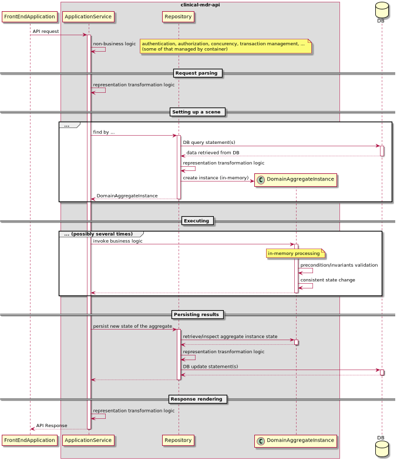

# Introduction

The purpose of this guide is to provide a clinical-mdr-api development team with some basic introduction to Domain Driven
Design concepts and guidelines and practices related to DDD assumed for the clinical-mdr-api implementation project.

The content of the guide is meant to be sort of first approximation and should be maintained and amended as applied practices
and patterns evolve with the progress of the project.

# Overview of DDD approach for clinical-mdr-api

From clinical-mdr-api software design perspective the crucial implication of applying Domain Driven Design is
introduction of the particular responsibility segregation pattern, which splits overall API request execution among
three "layers" of code:
* **domain layer** (esp. its central concept - aggregate) responsible for implementation of all relevant
  business logic,
* one or more **repositories** primary responsible for persisting and restoring objects representing domain (business) 
  concepts (aggregate instances) to/from underlying DB (providing relevant concurrency control and transaction semantics). 
  Repositories may also hold some responsibilities for data access/modification
  audit and data versioning (if required) since they provide data access for the rest of application,
* **application service** responsible for converting received API request content/parameters into relevant repositories and
  domain layer calls and their results into API responses, as well as establishing security, transaction and other
  relevant context for processing (which including authentication and authorization when relevant).

Diagram below illustrates main responsibilities of above layers of code and shows the overview of collaboration
between layers.

Note that given this kind of responsibility segregation there are at least three different representations of 
information processed by application when applying DDD approach:
* in-memory representation used by **domain layer** classes to execute business logic
* in-database representation used by **repositories** for persistent storage of domain objects instances (DB data model)
* representations used by **application services** to receive requests and send responses to API clients

---

As a design principle, it's assumed that different layer "talk" to each other using relevant public interfaces, 
so their specific 
information representation is encapsulated behind their public interfaces as well as actual implementation of 
operations/properties exposed by those interfaces (this principle of design is further referred 
as **encapsulation**). Applying encapsulation principle allows for lower coupling of the layers and more
independent evolution of their implementation.

---

**Note**: Since there are no "real" access modifiers in Python language. We assume a convention that all names exposed
by a package/module/class which do not start from leading underscore constitute a public interface of the package/module/class.

---

Having different representations used by the application implies a necessity to perform transformations. Given assumed
scenario of interactions between layers (see diagram above) we have two kinds of transformation logic:
* transformation of API request to relevant sequence of repository and domain layer calls, and their results back to API responses
  which is the responsibility of **application services**
* transformation of state of domain objects (aggregate instances) to/from their in-database representation which is the
  responsibility of **repositories**
  
---

**Note**: The latter transformation may be tricky with respect to above mentioned encapsulation principle, since
internal state of domain objects is not necessarily entirely exposed by their interfaces especially for manipulation.
In those cases a dedicated part of a domain class public interface for interaction with repositories is designed 
and implemented (based on so called [Memento pattern](https://en.wikipedia.org/wiki/Memento_pattern).

---

# General source code structure for DDD powered services

As noted in above section, there are three layers of code when DDD approach is applied:

**Service layer** code includes four kinds of source code (which is not specific for DDD approach, more originated from
applied FastAPI framework practices):
* routers located in `clinical_mdr_api/routers` package
* services located in `clinical_mdr_api/services` package
* classes used by FastAPI framework for representation and validation of incoming/outgoing API messages 
  (API requests and responses) which are located in `clinical_mdr_api/models` package
* classes used as API exceptions in `clinical_md_api/exceptions`

**Repositories** code (those which follow DDD pattern) is located in `clinical_mdr_api/domain_repositories`. 
Furthermore, a general convention is assumed to place a code defining and implementing a repository for given aggregate inside
subpackage named after the aggregate (e.g. `clinical_md_api/domain_repositories/study_definition`). However, in some
special cases the latter may not be strictly followed (e.g. see 
[Special remarks for simple dictionaries](#special-remarks-for-simple-dictionaries)). 

**Domain layer** code is located in `clinical_mdr_api/domain` package with a general convention of creating a separate 
subpackage for code implementing particular aggregate (e.g. `clinical_mdr_api/domain/study_definition` for study 
definition aggregate). However, same as for repositories the latter may be not strictly followed in some special cases.

There are also some additional assumptions about dependency structure among different layers of code:

* aggregate code should be independent of any other application code, including other aggregates code 
  (however aggregates may be dependent on some modules which are reused by different aggregates)
  
* repository code should be independent of any application code except code of the aggregate which is 
  persisted/restored by the repository (however the looser coupling the better, and if necessary different repositories 
  can depend on some modules which they reuse)
  
* service layer code (for some particular service) should be independent of any other service 
  (however different services may depend on some reusable modules)
  
The above dependency related principles are illustrated on the diagaram below:

# General development workflow for DDD powered services

In case of implementing some new feature in the clinical MDR API (or amending/fixing existing one) in most cases
a standard development workflow can be applied which consists of three phases:

* design, development and testing of relevant **domain layer** classes
* design, development and testing of relevant **repositories** (including changes in underlying DB 
  data model if necessary)
* design, development and testing of relevant **application service** layer code

Given some particular case it may happen that some of those phases are not relevant (i.e. there are layers not affected) 
however all of them should be considered and necessary actions taken.

Assuming this particular order of work has the advantage of allowing a step by step implementation. 
Since domain layer is the innermost layer
(i.e. independent of other layers), relevant changes in domain layer can be implemented and tested completely without 
need of any changes in other layers. Then after completing necessary work in domain layer one can move on to repository
implementation (if relevant) and again, since it's only dependent on domain layer, the work can be completed (including 
testing of the repository implementation). Then finally one can move on to relevant application service code development
and testing.

---

**Note:** This particular order of design and development process (especially starting from domain layer) is one of the
key aspect of Domain Driven Design in context of software development process (i.e. it's the domain model what drives 
the design of other layers, as opposed to approach where the design of software is driven or bounded by the design of 
underlying DB data model).

---

