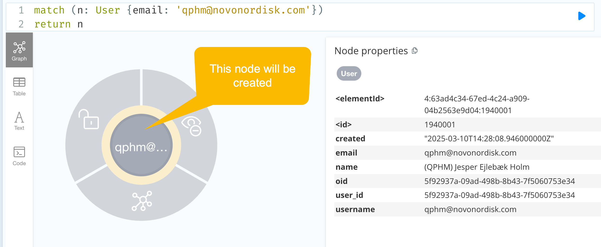

# Data Corrections: Applied to PRD after release 1.11.2

## 1. Template parameters hierarchy
List of relevant items used for populating `Activity Instance` template parameters is too wide, as described in [this bug](https://dev.azure.com/orgremoved/Digital%20Data%20Streams%20ART/_workitems/edit/2621134).

Data corrections script will remove the `HAS_PARENT_PARAMETER` relation between `TemplateParameter` nodes with names `Intervention` and `ActivityInstance`. 

As a result, the dropdown for populating the Activity Instance template parameters will not include irrelevant items anymore. 

## 2. Remove unused attributes in db nodes/relations
`user_initials` field is not used anymore to identify change authors, as it is replaced with `author_id` field since release 1.11.2.

Data corrections script will remove `user_initials` fields from all nodes/relations in the db. 

## 3. Create user that doesn't exist in MS Graph
End-user QPHM has performed changes on some Library and Study entities in 2024. However, he doesn't exist in MS Graph anymore, so db schema migration [script](https://orgremoved.visualstudio.com/Clinical-MDR/_git/db-schema-migration?path=/migrations/migration_010.py) was not able to create `User` node representing him.

Therefore, data corrections script will create the correct `User` node representing this user, 
and update all `author_id` fields on relevant nodes/relations to point to it.

As a result, UI will be able to display user's full email address instead of just initials.

