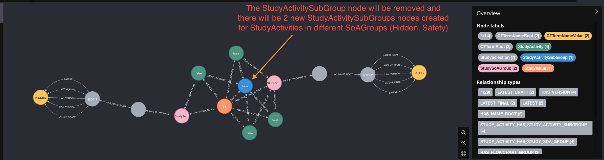

# Data Corrections: Applied to PRD after release 1.11.2

## 1. Separate StudyActivityGroups/StudyActivitySubGroups nodes that are linked by StudyActivities existing in different StudySoAGroups
There was an issue in the API which was fixed by [this PR](https://dev.azure.com/orgremoved/Clinical-MDR/_git/clinical-mdr-api/pullrequest/203233) in scope of release 1.11.2.
For the release 1.11.2 [schema-migration script](https://dev.azure.com/orgremoved/Clinical-MDR/_git/db-schema-migration/pullrequest/203457) fixed the half of broken nodes.
The part which was implemented in the mentioned schema-migration fixed these StudyActivities that had different SoAGroups and their SoAGroup was changed to be the same.
In that case the API bug was corrupting database because the StudyActivityGroup and StudyActivitySubGroup were not changed to be the same nodes if StudyActivities are from the same SoAGroup.

This data-correction handles the opposite issue. We could have two StudyActivities that exist in the same SoAGroup and then we change their SoAGroup to be different and the underlying StudyActivityGroup and StudyActivitySubGroup was not changed to be different nodes as they live in different SoAGroups.
This database corruption lead to issues with showing/hiding of items in the SoA.

