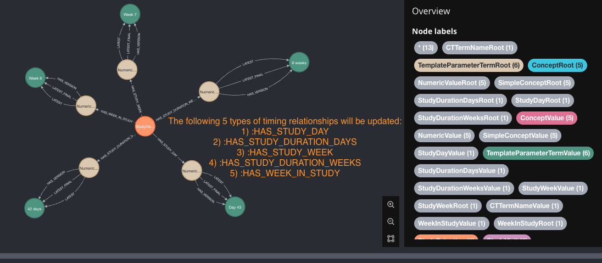
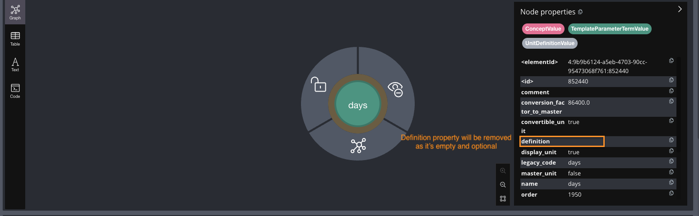
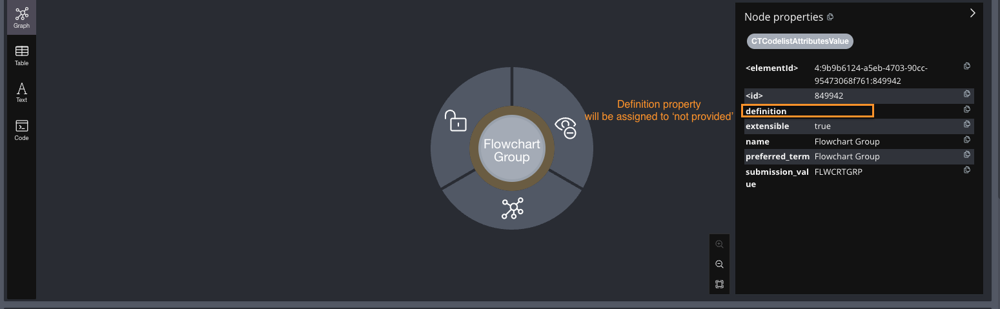
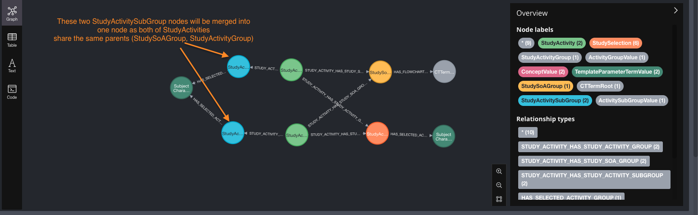

# Data Corrections: Applied to PRD after release 1.12.0

## 1. Correct study visit timing related nodes
### Problem description
The `StudyDay`, `StudyDurationDays`, `StudyWeek`, `StudyDurationWeeks`, `WeekInStudy` nodes containing information about absolute StudyVisit timing information were based on
    relative timing to the chosen anchor Visit. If StudyVisit is referencing global anchor visit, the timing related nodes are fine.
If StudyVisit refers to something else, then the timing related nodes are potentially affected.

### Change description
Creates new `StudyDay`, `StudyDurationDays`, `StudyWeek`, `StudyDurationWeeks`, `WeekInStudy` nodes if they don't exist for specific value
or finds the existing ones and reconnects StudyVisits to reliable timing related nodes.

### Nodes and relationships affected
- `StudyVisit` nodes where timinig related relationships
    (`HAS_STUDY_DAY`, `HAS_STUDY_DURATION_DAYS`, `HAS_STUDY_WEEK`, `HAS_STUDY_DURATION_WEEKS`, `HAS_WEEK_IN_STUDY`) were pointing wrong timing values.
- Expected changes: 58 StudyVisits affected, for each StudyVisit 5 different timing related relationships are updated.

## 2. Remove empty strings or replace them with 'not provided' text
### Problem description
Some nodes in the database have properties with empty string values. These empty strings are unnecessary and leads to inconsistencies.

### Change description
- For specific properties in certain node types, remove the property if its value is an empty string.

- For other properties, replace the empty string value with the text "not provided".

### Nodes and relationships affected
- Nodes with the following labels and properties will have the property removed if its value is an empty string:
    - ConceptValue: definition, abbreviation
    - ActivityInstanceValue: legacy_description, topic_code, nci_concept_id
    - ActivityInstanceClassValue: definition
    - ActivityItemClassValue: nci_concept_id
    - OdmDescriptionValue: sponsor_instruction, instruction
    - CriteriaTemplateValue: guidance_text
    - StudyEpoch: start_rule, end_rule, description
    - StudyVisit: start_rule, end_rule, description
    - StudyArm: description, randomization_group, arm_code
    - UnitDefinitionValue: comment
    - OdmItemGroupValue: comment
    - OdmItemValue: comment, prompt
    - CTTermAttributesValue: preferred_term
    - DictionaryTermValue: abbreviation
- Nodes with the following labels and properties will have the empty string value replaced with "not provided":
    - CTTermAttributesValue: definition
    - CTCodelistAttributesValue: definition

## 3. Merge duplicated StudySoAGroup/StudyActivityGroup or StudyActivitySubGroup
### Problem description
Some StudySoAGroup/StudyActivityGroups or StudyActivitySubGroups can be duplicated in a single Study.
This means that there exists duplicated StudySoAGroup/StudyActivityGroups or StudyActivitySubGroups in scope of the same parent. 

### Change description
- If some StudySoAGroup/StudyActivityGroups or StudyActivitySubGroups is duplicated, it should be merged.
    The visitbility flag is set to true if any of the duplicated nodes had it initialized to true.
    This is how API algorithm currently works so it ensures the visibility remains the same in the Protocol SoA.

### Nodes and relationships affected
- Nodes with the following labels and properties will have the property removed if its value is an empty string:
    - StudySoAGroup
    - StudyActivityGroup
    - StudyActivitySubGroup
    - StudyActivity
    - STUDY_ACTIVITY_HAS_STUDY_SOA_GROUP
    - STUDY_ACTIVITY_HAS_STUDY_ACTIVITY_GROUP
    - STUDY_ACTIVITY_HAS_STUDY_ACTIVITY_SUBGROUP
    - HAS_STUDY_SOA_GROUP
    - HAS_STUDY_ACTIVITY_GROUP
    - HAS_STUDY_ACTIVITY_SUBGROUP

