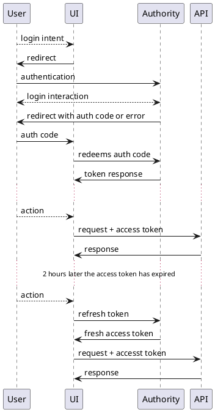

# Authentication and Authorisation Architecture

This document describe the design specification for access control, authentication and authorisation in the StudyBuilder system.

## Access control

### Front-end access

Cuurently we have not implemented access groups for the front-end application. So if a user have access to the StudyBuilder system the user can use all functionalities.

### API access

Cuurently we have not implemented access groups for the API service. So if a user have access to the StudyBuilder system the user can use all API endpoints.

### Database access

 - Must be possible to access the database directly, so graph enabled tools can be used – e.g. NeoDash and Bloom
 - The direct database access must be read-only
 - All write, update and deletes must be made via the Clinical MDR API service
 - In a later release we plan to add fine grained data level access control – the cypher queries will only return data the named user have access to
 - In this case the API service must return data and create / update data – that the user has access to. This have to be done via the API service, so running on a dedicated user app account or a general system account with delegated permissions as a dedicated named user
 - See more on [Neo4j access control](https://neo4j.com/docs/operations-manual/current/authentication-authorization/access-control/)

## Authentication

Access tokens are used for authorization.
OAuth 2 and the superimposed OpenID Connect protocols are used for authentication and obtain a set of tokens.
Tokens are issued by an identity provider (aka. authority).
We use Microsoft Identity Platform aka. Azure Active Directory.
API requires the client to send a valid access-token with each HTTP request (as a header) for authorization and for tracing who is the acting user.
JWT tokens are cryptographically signed, access tokens are short living, and contain a set of claims as payload.
Those claims are configurable on the identity provider, and includes a list of scopes (interpreted as a set of permissions by the API), and basic information regarding the user.

Recommended reading:
- [Scenario description: Protected web API - verify users calling a web api](https://docs.microsoft.com/en-us/azure/active-directory/develop/scenario-protected-web-api-overview)
- [Microsoft Identity Platform access tokens](https://docs.microsoft.com/en-us/azure/active-directory/develop/access-tokens) 

### Authorization code flow

The client has to initiate an [OAuth 2.0 authorization code flow](https://docs.microsoft.com/en-us/azure/active-directory/develop/v2-oauth2-auth-code-flow) (also called authorization code grant) with the Microsoft Identity provider.
StudyBuilder UI uses [oidc-client-ts](https://github.com/authts/oidc-client-ts) library, which supports the OAuth 2.0 and OpenID Connect protocols, and also reads the [OpenID Connect Discovery](https://openid.net/specs/openid-connect-discovery-1_0.html) metadata from the identity provider for configuration.
The client has to request a specific set of scopes at authentication otherwise the token response could miss the refresh token or the access token claims and signature would be invalid for our API.
We still don't know how to get around this by granting a set of default scopes with each authentication request. 

The authentication starts by redirecting the browser to the Identity Provider's site, where the users can authenticate themselves using their Active Directory credentials.
For the StudyBuilder UI this means leaving the application in the active browser tab to Ms. IDP, but technically it could happen also in a popup window.

After authentication, the browser gets redirected back to the client application, with some payload as query parameters.
Those parameters could be either an error response or an authorization code.
In case of an authorization code, the client connect back to the Identity Provider and redeems the code for a set of tokens (access token, id token and refresh token).

- Access token is used to gain access to the API.
- Refresh token can be used to obtain a new access token when the previous one expires (perhaps replacing the refresh token as well).
- Id token is used for trustworthy communication of user identity. In StudyBuilder we only use it to display information about the user in the UI.

Recommended reading:
- [Authorization request](https://www.oauth.com/oauth2-servers/authorization/the-authorization-request/)
- [Authorization code response](https://www.oauth.com/oauth2-servers/authorization/the-authorization-response/)
- [Authorization code flow for single-page apps](https://www.oauth.com/oauth2-servers/single-page-apps/)
- [Authorization code flow](https://docs.microsoft.com/en-us/azure/active-directory/develop/v2-oauth2-auth-code-flow) on Microsoft Identity Platform
- [OAuth 2.0 RFC6749](https://datatracker.ietf.org/doc/html/rfc6749)
  - [Authorization code flow](https://datatracker.ietf.org/doc/html/rfc6749#section-4.1)
  - [Refreshing an access token](https://datatracker.ietf.org/doc/html/rfc6749#section-6)
- [OpenID Connect Core 1.0](https://openid.net/specs/openid-connect-core-1_0.html)

#### Flow Diagram

- **User**: the actor with their browser
- **UI**: StudyBuilder UI Single-Page-Application running in user's browser
- **Authority**: the OAuth Authority, aka. Identity Provider, in our case this is Azure Active Directory
- **API**: our Clinical-MDR API Python application

### Current Setup

We use Microsoft Identity Platform aka. Azure Active Directory as our authentication provider (aka. authority).

API application is registered with Ms. IDP, and all client applications (including StudyBuilder UI, FastAPI built-in Swagger UI) are registered as separate client applications, and future clients should too. (This gives us a finer control over our setup.)

The API app must have at least one scope configured, and that scope has to be requested by the client at authentication, otherwise the issued access token audience will be set to Ms. Graph API, and therefore deemed invalid for our application. (Also standard JWT validation will not work on such tokens.)

- Local development environment can be set up to authenticate to a sandbox tenant.
- Shared Dev environment will be set up with the Novo Active directory
- Edu environment will have the authentication disabled for now

#### App registrations on Azure Active Directory

API app and client apps are registered as distinct apps on Azure AD.

##### API application registration:

- give it a name
- **Authentication** menu: leave defaults, no URLs added, *Allow public client flows* disabled by default
- **Certificates and Secrets**: none used
- **Token configuration**: no special claims configured
- **Expose API**:
  - Configure *Application ID URI*
  - *Add a scope*: for now we use `API.Call` only, *Admins and users* can both consent
  - You need to revisit this menu to add client apps to *Authorized client applications*
- **App roles**: none
- **Owners**: as you wish
- **Roles and administrators**: we have *Cloud application administrators* there
- **Manifest**: edit and modify `"accessTokenAcceptedVersion": 2,`
- take a note on the **Overview** page of *Application ID* and *Application ID URI*

Also take a note of the *OpenID Connect metadata document* URL from the *App registrations* menu **Endpoints** submenu (top of the center content-area)

##### Client application registration:

- **Authentication**:
  - For **Swagger UI** add a *Single-page application* URI with your API host in the URI like `http://localhost:8000/docs/oauth2-redirect` (but always use HTTPS unless it's localhost)
  - For **StudyBuilder UI**: add a *Single-page application* URI to your SPA like `http://localhost:8080/oauth-callback` (but always use HTTPS unless it's localhost)
  - For the **StudyBuilder Word addon**: add a *Mobile and desktop application* and enable all tree pre-defined redirect URLs for now (this is under development)
- **API permissions**: add
  - *Microsoft Graph / User.Read*
  - Add -> My APIs -> pick your API app -> *API.Call*
- **Manifest**: edit and modify `"accessTokenAcceptedVersion": 2,`
- take a note of *Application (client) ID* on the **Overview** page
- register as client application on the API application's **Expose API** page

#### Setting up a client application

- **Metadata document**: Some client apps can do an OpenID Connect Discovery with the *OpenID Connect metadata document* URI you have noted above. (*authority* parameter in case of oidc-client-ts library) Otherwise you can see this document in the browser to find the *token_endpoint* and *authorization_endpoint* (and perhaps more URLs) required by non-discovery clients.
- **Client ID**: as noted at registration
- **Redirect URI**: the callback URL where your client expects the auth code during authorization-code-flow redirect, as registered above for the client application
- **Response type**: *code* or similar setting that tells the client library that we are doing an authorization-code-flow
- **Scope**: this is **the important thing**, if we do it wrong, we won't get a refresh or id token, or we would get a wrong access token that was not meant to be used by our API and also signature verification could fail. **Add all the following scopes** usually as a space-separated string
  - `openid` to receive an ID token
  - `profile` not sure about this one, but we may miss some claims in the tokens regarding the user identity
  - `email` to get the email address of the user as a claim
  - `offline_access` otherwise we may not get a refresh token
  - `api://d3e62185-f259-4d5b-8a8c-a9134fd34d47/API.call` prefix `API.call` with the *Application ID URI* noted above at API app registration. We must claim at least one scope from our API app, otherwise the audience claim in the access token will be *000003-....*-like (Microsoft Graph) instead of our API app ID, and also the token validation would fail (on signature validation too). 

## Authorization

API requires a valid access token on (almost) all endpoints.
- The token is a JWT.
- Signed by known issuer.
- Signature is validated by fetching the signing public key from a known URL (defined by the authority in it's Openid Connect Discovery metadata.)
- The token contains a set of required and optional key-value payload, called claims.
  - Expirity date is checked, as access tokens are short-lived, typically from 5 minutes to a few hours.
  - Audience is checked, so the token was destined to be used by our API.
  - A set of scopes interpreted as permissions, what the user can do with the API.

At the current state the API does not require any scopes to be claimed in the access token, just checks for a valid token. Later the API will define various scopes, and user roles will be defined on the Identity Platform to grant a different set of scopes for different users based on group membership.

### StudyBuilder UI client

UI starts with a landing page with a login button, which starts the authorization code flow. On success, the browser gets redirected back to into the application.
The result of the auth code flow provides the UI with access, refresh, and id tokens.

Then the UI sends the access token as `Authorization: Bearer fb6ac92cd.....` with each request to the API. UI should check when the token gets expired, and use the refresh token to obtain a new access token.
