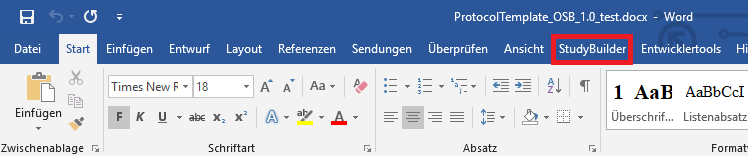
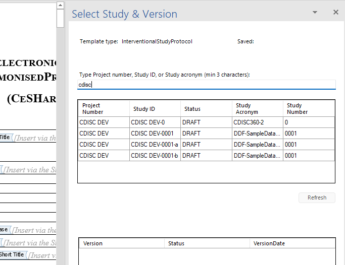
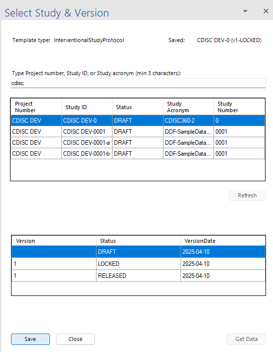
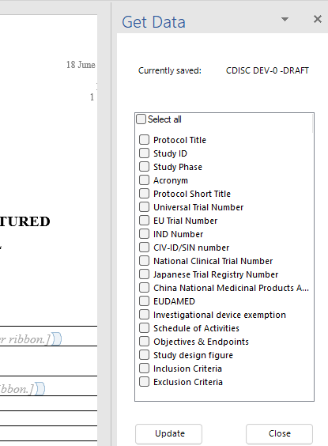
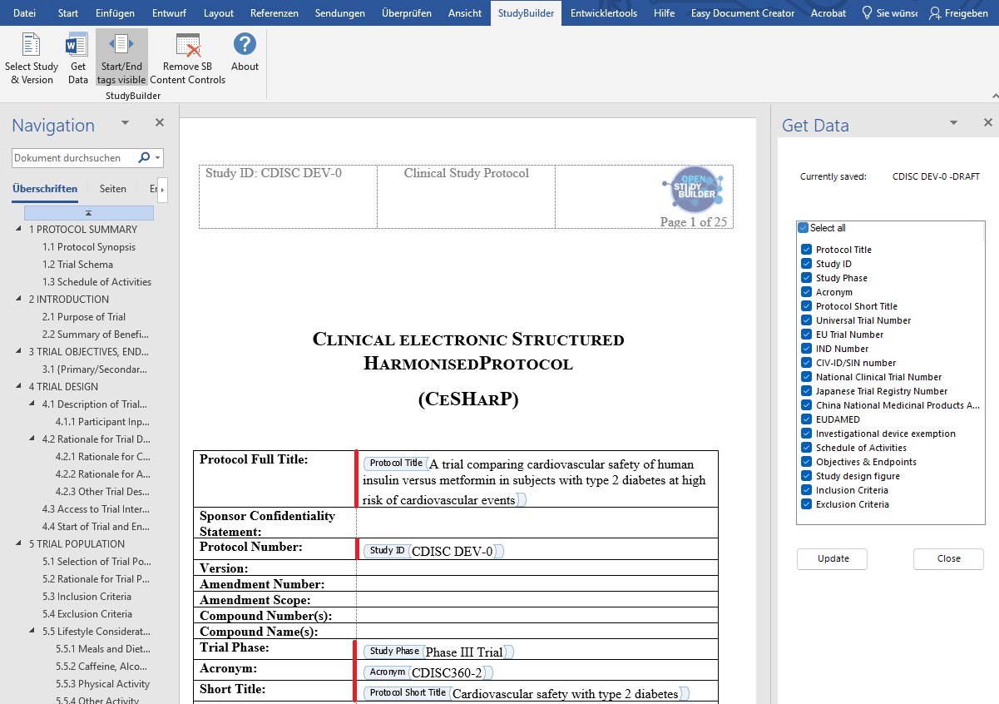
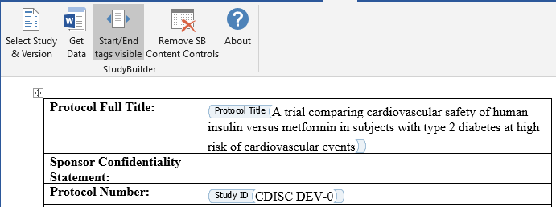
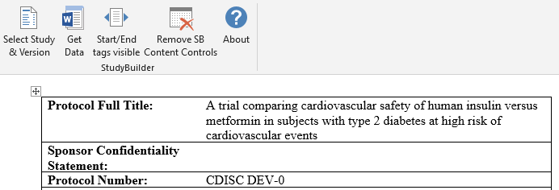
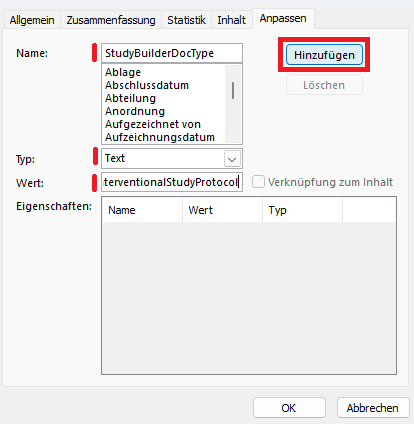

# Documentation of OpenStudyBuilder Word Add-In

The following files are required to install and test the OpenStudyBuilder Word Add-In:

- Executable installation files
- Draft Word Template (e.g. ProtocolTemplate_OSB_1.0.docx)

## Pre-compiled Test Installation

Follow the build and installation instructions in the [README.md](../README.md) file to build and install the OpenStudyBuilder Word Add-In. For the pre-compilled test installation which is not recommended, follow the installation as described below.

The available executables are build using a development certificate. This means it's unlikely you will be able to install the add-in on controlled devices. You need to decide on your own, whether you trust the executable or not - the windows installation is asking.

The Word Add-In as an extension to Microsoft Word. It's required to have a version of Microsoft Word installed on your device - the plugin has been tested with Office 365 and Microsoft Word 2019. 

The installation is done by running the executable file. The installation will add the Add-In to your Word application. You need to use the following configuration to connect with the OpenStudyBuilder sandbox instance:

- **Client Id**: 6d7f11d8-d150-4487-b5ef-77423b1ae513
- **Tentant Id**: 54e85725-ed2a-49a4-a19e-11c8d29f9a0f
- **Scopes**: api://6d7f11d8-d150-4487-b5ef-77423b1ae513/API.Call, openid, profile, email, offline_access
- **Url**: https://openstudybuilder.northeurope.cloudapp.azure.com/api

## Usage

Start your Microsoft Word (tested with Office 360 and Office 2019) – in the Ribbon, there is a new item called "StudyBuilder".

Open the file "ProtocolTemplate_OSB_1.0.docx" as the ribbon will only work with a document containing specific settings and tags.

The icons should be visible when this document is opened. Click “Select Study & Version”. Now a right ribbon opens. Enter a search type into the first search field, e.g. “cdisc”. 

Follow the login instructions for your Microsoft Neo4j account (the mail used to login for the sandbox). There is a second access right screen mentioning that special access rights are required. Press “request access” and send a mail to <a href="mailto:openstudybuilder@neotechnology.com">openstudybuilder@neotechnology.com</a>, mentioning that you requested special access to test the OpenStudyBuilder Word-Add-In version. It might take some time till access is granted.

When access is granted – after login the studies are listed and can be selected. Select your study and version and click “Save”.

Now you can click “Get Data” or click on the top ribbon “Get Data” to get the next ribbon menu. 

In the “Get Data” menu, you can see what fields are available in your Word Document which you can update with data from the OpenStudyBuilder environment. You could select some or all and click “Update” – this will include the data from OpenStudyBuilder into your word document.

After the update you can see the content:

When you perform changed in the OpenStudyBuilder and want to update your word document. Perform the same steps as before – open your document, select your study, select items you want to update and click the “update”.

The "Start/End tags visible" can be toggled to view or hide the tags. 

Tags visible:

Tags hidden:

You can remove all content controls in the final document by pressing the “Remove SB Content Controls” tag. This should only be done when no changes are expected.

### Setup Template

When a new protocol template should be created, there are a few things to consider. When the header of the document contains a table, the first table cell will be replaced by “Study ID: <selected id>” by the add-on automatically.

The Add-On will only work on a template having the attribute “StudyBuilderDocType” with the value “InterventionalStudyProtocol”. This can be created by looking at the document properties: “File” -> “Information” -> click “Properties” -> click “Advanced Properties” then go to “Adopt” and include this as a new text value.

Finally, include the specific content control placeholders which contents will be replaced by the information from the OpenStudyBuilder. You can copy them from the existing document.

